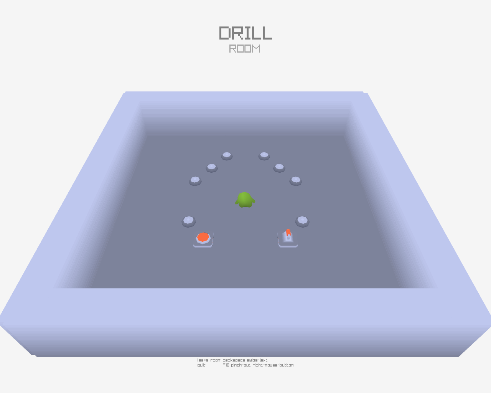
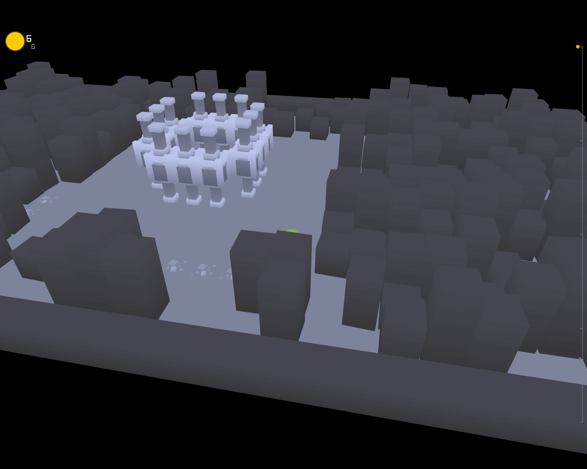
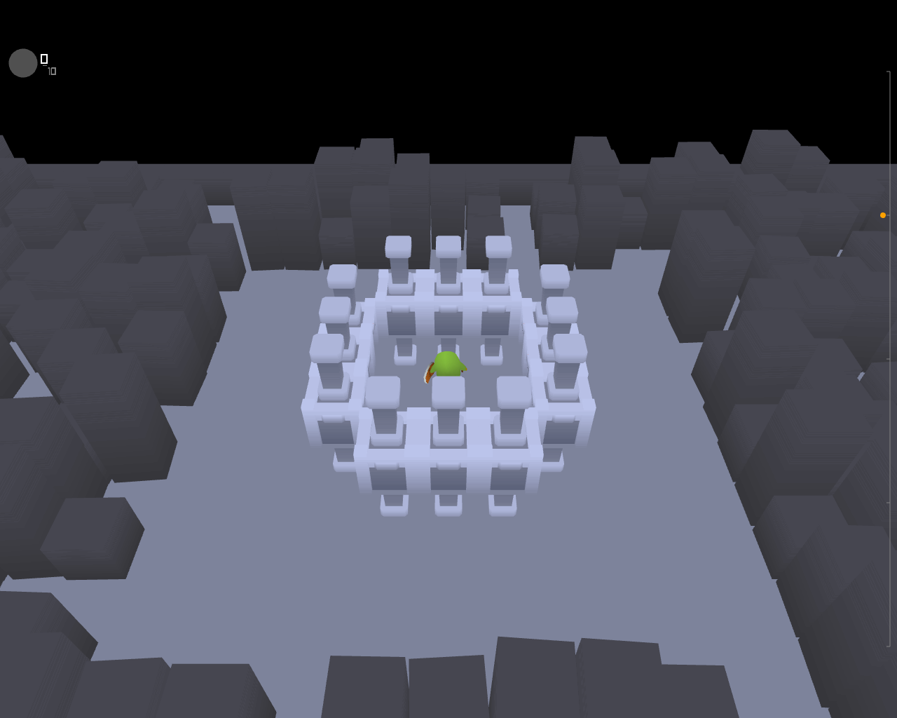
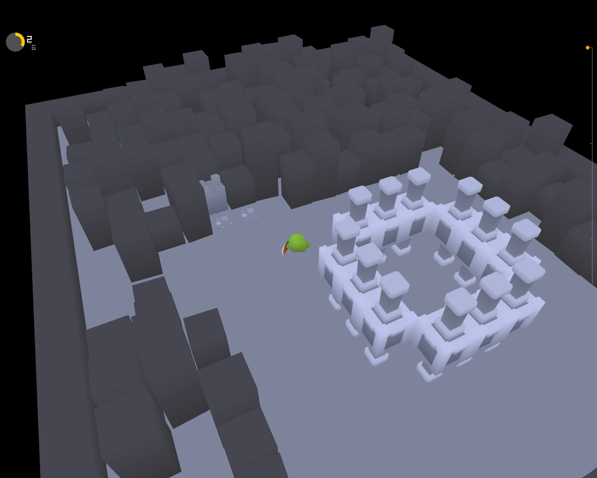
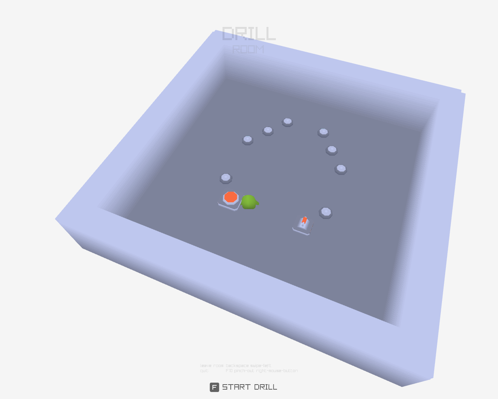

# Depths

A lone alien searching the depths in the depths of an asteroid hurling in space.

> [!WARNING]
> This project was made for a game jam. It is not the ideal way to do things.



## Game controls

| Keymap | Description |
| ------------- | -------------- |
| WASD                  | Move player |
| Spacebar/Mouse Left   | Action |
| F                     | Interact |
| Arrow Keys/Mouse      | Move camera around |
| Esc                   | Force quit |

## Install

- Download the executable/binary from the Links > Binary. [Direct link](https://github.com/lloydlobo/depths/releases/tag/v0.1.0-alpha)
- Create a new folder and call it anything you want, e.g. "game"
- Move the executable in it
- Change the access permission. Gives the [u]ser who owns a file the right to e[x]ecute it:
```shell
chmod u+x depths
```
- Download the `res` and `storage` folder from https://github.com/lloydlobo/depths/archive/refs/heads/master.zip or see the repository itself at https://github.com/lloydlobo/depths
- Move the `res` and `storage` folders into the newly create `game` directory. Note that it has the executable there already.
- Go into the `game` folder.
- Execute the `depths` executable/binary in your terminal with `./depths`, or double click on it.

## About

The game is nowhere near completion, although it has a small demo, to showcase
a fraction of the core idea.

It's a little prototype I made, while trying on 3D game programming for the first time.

Used Raylib with Go [raylib-go bindings](https://github.com/gen2brain/raylib-go) to put this together.
NOTE: Compilation requires raylib-go, and other dependencies.

This game's theme is a heavily inspired adaptation of [Dig and Delve](https://annekatran.itch.io/dig-and-delve).

Thanks to all the artists of the wonderful music included, and to Kenney for the amazing assets

License of assets are credited in `res/licenses.md`.

## Preview

> [!NOTE]
> Progress so far...

### Screenrec

<details>

<summary>Expand</summary>


</details>


### Screenshot

<details>

<summary>Expand</summary>






</details>



